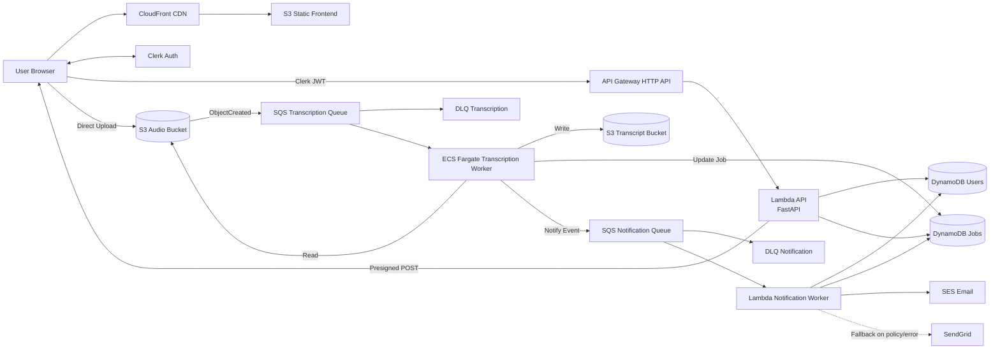

# Audio Transcription Platform - Project Overview

## Project Summary

A distributed, event-driven audio transcription platform built on AWS, designed to handle 100,000+ audio files per day with high availability and cost efficiency.

## Business Requirements

| Requirement | Specification |
|-------------|---------------|
| **Throughput** | 100,000 files/day (spikes to 300k) |
| **File Size** | Average 20 MB, ~10 minutes |
| **Processing** | Asynchronous (non-blocking) |
| **Availability** | 99.99% uptime |
| **Budget** | $50k/month |
| **Accuracy** | >= 95% transcription accuracy |
| **Languages** | English + Spanish |
| **Notifications** | User notified on completion |

## Core Architecture Principles

### Event-Driven & Decoupled
```
Client -> API -> Storage -> Queue -> Workers -> Notification
```

**Key Principle**: No component blocks another. All services are loosely coupled through events and queues.

### Asynchronous Processing Flow

**Why Async?**
- No synchronous large-file upload through API runtime.
- Direct browser upload to S3 keeps API lightweight and scalable.

### System Architecture Diagram



## Technology Stack

### Infrastructure (Provisioned via Terraform)

| Layer | Service | Purpose |
|-------|---------|---------|
| **Authentication** | Clerk | User auth + JWT tokens |
| **API Layer** | API Gateway (HTTP API) + Lambda | REST API control plane |
| **Storage** | S3 (2 buckets) | Audio input + transcript output |
| **Database** | DynamoDB | User + job tracking & metadata |
| **Queue** | SQS + DLQ | Event processing + failure handling |
| **Compute (Transcription)** | ECS/Fargate | Whisper worker execution |
| **Compute (Notifications)** | Lambda | SQS-triggered email handling |
| **CDN** | CloudFront | Frontend delivery |
| **Email** | SES (+ SendGrid fallback) | User notifications |
| **Monitoring** | CloudWatch | Metrics, logs, alarms |

### Application Stack

| Component | Technology |
|-----------|------------|
| **Transcription Model** | OpenAI Whisper-tiny (preloaded) |
| **Frontend** | Next.js + React (static export) |
| **Backend API** | FastAPI (Python Lambda) |
| **Workers** | Python (containerized ECS worker + notification Lambda) |

## Key System Components

### 1. Upload Flow (Presigned URLs)

```
1. User -> API: create transcription job
2. API -> DynamoDB: create job entry
3. API -> S3: generate presigned POST
4. API -> User: return upload form data
5. User -> S3: direct upload (no API file proxy)
6. S3 -> SQS: upload event enqueued
```

**Benefits**:
- API never handles large files
- Automatic upload scaling
- Zero server bottleneck

### 2. Storage Layer (Dual Bucket Strategy)

**S3 Bucket #1: Raw Audio**
```
audio/{clerk_user_id}/{job_id}/original.ext
```
- Stores original audio files
- Triggers event on upload completion
- Supports lifecycle/cost controls

**S3 Bucket #2: Transcriptions**
```
transcripts/{clerk_user_id}/{job_id}/transcript.txt
```
- Stores final transcripts
- Downloaded via presigned URL
- Can be served through CloudFront for frontend access patterns

### 3. Event-Driven Processing

```
S3 Upload Complete -> SQS Transcription Queue -> ECS Worker
```

**Why Queues?**
- Buffer for traffic spikes (100k -> 300k)
- Independent worker scaling
- At-least-once delivery with retry + DLQ
- Decouples upload from processing

### 4. Worker Fleet (ECS/Fargate)

**Transcription Worker Lifecycle**:
```
1. Poll transcription queue
2. Download audio from S3
3. Run Whisper transcription
4. Upload transcript to S3
5. Update DynamoDB status
6. Push message to notification queue
7. Delete SQS message
```

**Why Preload Models?**
- Avoids repeated model load overhead
- Lower latency per job
- Better compute efficiency

### 5. Failure Handling (Production-Ready)

**Retry Strategy**:
- Queue retry with visibility timeout + max receive count
- After repeated failures -> DLQ
- Job status set to FAILED
- Failure details available in logs/job record

### 6. Notification Pipeline (Separation of Concerns)

```
Worker -> SQS Notification Queue -> Notification Lambda -> SES/SendGrid
```

**Why Separate Queue?**
- Keeps transcription and email responsibilities isolated
- Email outages do not block transcription pipeline
- Independent scaling and debugging path

**Notification Content**:
- Job completion status
- File/job reference
- Temporary transcript download link
- Failure reason if failed

### 7. Autoscaling Logic

**Current MVP behavior**:
- ECS service desired count is explicitly managed (Terraform + manual updates).
- Queue depth and DLQs are monitored in CloudWatch.

**Planned advanced policy**:
```
messages_in_queue / active_workers -> target tracking
```

### 8. Cost Estimation

Assumptions for estimates below (us-east-1 style pricing, approximate, verify before production):

- Fargate on-demand:
  - vCPU: `$0.04048 / vCPU-hour`
  - memory: `$0.004445 / GB-hour`
- Worker task size (current): `2 vCPU + 4 GB RAM`
- S3 Standard storage: `$0.023 / GB-month`
- SQS Standard: `$0.40 / 1M requests`
- SES outbound: `$0.10 / 1,000 emails` (free-tier/sandbox caveats apply)

#### A) MVP/Showcase Cost (always-on minimal stack)

1) **Worker (1 task, 24x7)**
```
Hourly worker cost
= (2 x 0.04048) + (4 x 0.004445)
= 0.08096 + 0.01778
= $0.09874 / hour

Monthly worker cost (730 hours)
= 0.09874 x 730
= ~$72.08 / month
```

2) **S3 storage example (100 GB total across both buckets)**
```
100 x 0.023 = $2.30 / month
```

3) **SQS example (100 jobs/day)**
- Approx requests/job (transcription + notification): ~6
```
Requests/month = 100 x 30 x 6 = 18,000
SQS cost ~= negligible (<$0.01/month)
```

4) **SES example (100 emails/day)**
```
100 x 30 = 3,000 emails/month
3,000 / 1,000 x 0.10 = $0.30 / month
```

**MVP ballpark total**: roughly `$80-$150/month` (depends mostly on worker uptime and log/storage growth).

#### B) Target Scale Thought-Experiment (100k files/day)

Given requirement:
```
100,000 files/day x 10 min/file = 1,000,000 audio-min/day
```

If throughput is roughly real-time (`RTF ~= 1.0`) per worker stream:
```
Required concurrent workers
= 1,000,000 / 1,440
= ~694 workers
```

Worker compute only:
```
$72.08/worker-month x 694
= ~$50,024 / month
```

Storage growth from raw audio only:
```
100,000 x 20 MB/day = 2,000,000 MB/day ~= 2 TB/day
~60 TB/month stored (if not lifecycle-pruned)
60,000 GB x 0.023 = ~$1,380 / month
```

SQS at this volume (6 requests/job):
```
100,000 x 30 x 6 = 18,000,000 requests/month
18 x 0.40 = ~$7.20 / month
```

SES at this volume (1 email/job):
```
3,000,000 emails/month
3,000,000 / 1,000 x 0.10 = ~$300 / month
```

**Important conclusion**:
- At true 100k/day scale, compute is the dominant cost driver.
- To stay safely under `$50k/month`, you would likely need optimization beyond current MVP:
  - faster-than-real-time inference per worker
  - autoscaling with zero-idle windows
  - aggressive lifecycle/retention
  - possibly mixed compute strategy (Spot/EC2 for workers)

### 9. Advanced Features

**Long Audio Handling** (future):
- Chunking and parallel transcription
- Reassembly before final transcript write

**High-Read Traffic**:
```
User -> CloudFront -> S3
```

### 10. Monitoring & Observability

**System Metrics**:
- SQS queue depth + DLQ depth
- ECS worker logs and restarts
- Lambda errors and duration
- API latency/error rates
- S3 request/transfer metrics

## Project Structure

```
audio_transcription/
|-- gameplan.md
|-- guides/
|   |-- README.md
|   |-- 01-database.md
|   |-- 02-queues.md
|   |-- 03-storage.md
|   |-- 04-api-gateway-lambda.md
|   |-- 05-workers.md
|   |-- 06-notifications.md
|   |-- 07-end-to-end-validation.md
|   `-- 09-frontend.md
|-- terraform/
|   |-- 01_database/
|   |-- 02_queues/
|   |-- 03_storage/
|   |-- 04_api/
|   |-- 05_workers/
|   |-- 06_notifications/
|   `-- 07_frontend/
|-- backend/
|   |-- api/
|   |-- database/
|   |-- queues/
|   |-- worker/
|   `-- notify/
`-- frontend/
```

## Development Roadmap

See `/guides` for implementation steps.

**Phase 1: Core Infra** (Guides 01-03)
- Database, queues, storage/event wiring

**Phase 2: Execution Plane** (Guides 04-06)
- API Lambda + Gateway
- ECS transcription worker
- Notification Lambda

**Phase 3: Validation + UX** (Guides 07, 09)
- Full end-to-end test
- Frontend deploy and production validation

## Reference Implementation

The `for-coding-pattern` folder remains the reference for coding and infrastructure patterns used in this project.

## Next Steps

1. Follow `guides/README.md` in strict order.
2. Keep `.env` updated after each module apply.
3. Run backend end-to-end validation before frontend deployment.
