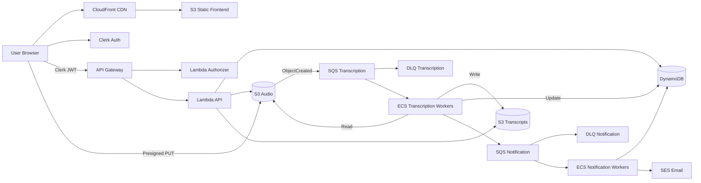

# Audio Transcription Platform - Project Overview

## Project Summary

A distributed, event-driven audio transcription platform built on AWS, designed to handle 100,000+ audio files per day with high availability and cost efficiency.

## Business Requirements

| Requirement | Specification |
|-------------|---------------|
| **Throughput** | 100,000 files/day (spikes to 300k) |
| **File Size** | Average 20 MB, ~10 minutes |
| **Processing** | Asynchronous (non-blocking) |
| **Availability** | 99.99% uptime |
| **Budget** | $50k/month |
| **Accuracy** | ≥ 95% transcription accuracy |
| **Languages** | English + Spanish |
| **Notifications** | User notified on completion |

## Core Architecture Principles

### Event-Driven & Decoupled
```
Client → API → Storage → Queue → Workers → Notification
```

**Key Principle**: No component blocks another. All services are loosely coupled through events and queues.

### Asynchronous Processing Flow

**Why Async?**
- ❌ Synchronous = API server handles 20MB uploads → bottleneck → failure
- ✅ Asynchronous = Direct S3 upload → event trigger → scalable processing

### System Architecture Diagram



## Technology Stack

### Infrastructure (Provisioned via Terraform)

| Layer | Service | Purpose |
|-------|---------|---------|
| **Authentication** | Clerk | User auth + JWT tokens |
| **API Layer** | API Gateway + Lambda | REST API control plane |
| **Storage** | S3 (2 buckets) | Audio input + transcript output |
| **Database** | DynamoDB | Job tracking & metadata |
| **Queue** | SQS + DLQ | Event processing + failure handling |
| **Compute** | ECS/Fargate | Transcription & notification workers |
| **CDN** | CloudFront | Frontend delivery + transcript caching |
| **Email** | SES | User notifications |
| **Monitoring** | CloudWatch | Metrics, logs, alarms |

### Application Stack

| Component | Technology |
|-----------|------------|
| **Transcription Model** | OpenAI Whisper (preloaded) |
| **Frontend** | Next.js/React (Static) |
| **Backend API** | Python/Node.js Lambda |
| **Workers** | Python (containerized) |

## Key System Components

### 1. Upload Flow (Presigned URLs)

```
1. User → API: "I want to upload audio"
2. API → S3: Generate presigned URL
3. API → DynamoDB: Create job entry (PENDING)
4. API → User: Return presigned URL
5. User → S3: Direct upload (no API involvement)
6. S3 → Event: Upload complete
```

**Benefits**:
- API never handles large files
- Automatic upload scaling
- Zero server bottleneck

### 2. Storage Layer (Dual Bucket Strategy)

**S3 Bucket #1: Raw Audio**
```
/user_id/job_id/audio.wav
```
- Stores original audio files
- Triggers events on upload completion
- Lifecycle policy for cost optimization

**S3 Bucket #2: Transcriptions**
```
/user_id/job_id/transcript.txt
```
- Stores final transcripts
- Served via CloudFront CDN
- Presigned URLs for secure access

### 3. Event-Driven Processing

```
S3 Upload Complete → S3 Event → SQS → Worker Pool
```

**Why Queues?**
- Buffer for traffic spikes (100k → 300k)
- Enables independent autoscaling
- Guaranteed message delivery
- Decouples upload from processing

### 4. Worker Fleet (ECS/Fargate)

**Transcription Worker Lifecycle**:
```
1. Poll SQS for messages
2. Download audio from S3
3. Run Whisper transcription (preloaded model)
4. Upload transcript to S3
5. Update DynamoDB status
6. Delete SQS message
```

**Why Preload Models?**
- Loading Whisper per-job = 30s overhead
- Preloaded = instant start
- Massive latency & cost savings

### 5. Failure Handling (Production-Ready)

**Retry Strategy**:
- Exponential backoff: 5m → 25m → 125m
- Max retries: 3 attempts
- After failure → Dead Letter Queue (DLQ)
- Status updated to FAILED
- User receives failure notification
- Ops team can inspect & replay

### 6. Notification Pipeline (Separation of Concerns)

```
Worker → SQS Notification Queue → Notification Worker → SES
```

**Why Separate Queue?**
- Transcription ≠ notification responsibility
- Email service outages won't block processing
- Independent scaling & monitoring
- Clean architecture

**Notification Content**:
- Job completion status
- Temporary download link (expires in 24h)
- Transcript preview

### 7. Autoscaling Logic

**Key Metric**: Queue Depth Per Worker
```
= messages_in_queue / active_workers
```

**Scaling Thresholds**:
- Scale UP if > 500 messages/worker
- Scale DOWN if < 200 messages/worker

**Scaling Formula**:
```
Change = max(20% of current, 10 workers)
```

**Example**:
```
10,000 jobs / 10 workers = 1,000 messages/worker
→ Scale UP: add max(2, 10) = 10 workers
→ New capacity: 20 workers
```

### 8. Cost Estimation

**Storage** (S3):
```
100k files/day × 20MB = 2TB/day
≈ 60TB/month
≈ $4,100/month
```

**Transcription** (Compute):
```
100k files × 10 min = 1M minutes/day
Whisper on ECS (CPU optimized): ~$15,000/month
```

**Infrastructure** (API, DB, Networking):
```
≈ $3,000/month
```

**Total Estimated**: ~$22k/month (comfortably within $50k budget)

### 9. Advanced Features

**Long Audio Handling** (2+ hour files):
- Chunk audio into 10-minute segments
- Parallel processing across workers
- Reassemble transcript before upload
- Horizontal ML scaling

**High-Read Traffic** (CDN Strategy):
```
User → CloudFront (cached) → S3 Transcripts
```
- Near-zero latency
- Protects S3 from read storms
- 90%+ cache hit ratio
- Massive cost reduction

### 10. Monitoring & Observability

**Business Metrics**:
- Jobs created/completed/failed per minute
- Cost per transcription
- User satisfaction (feedback)

**System Metrics**:
- SQS queue depth & age
- Worker CPU/memory utilization
- DynamoDB read/write capacity
- API Gateway latency & errors
- S3 request rates

**ML Metrics**:
- Transcription confidence scores
- Accuracy drift detection
- Language distribution
- Processing time per file

## Project Structure

```
audio_trans/
├── gameplan.md           # This file
├── guides/               # Step-by-step implementation guides
│   ├── 01-infrastructure-setup.md
│   ├── 02-authentication.md
│   ├── 03-api-gateway-lambda.md
│   ├── 04-storage-layer.md
│   ├── 05-database.md
│   ├── 06-queue-system.md
│   ├── 07-transcription-workers.md
│   ├── 08-notification-system.md
│   ├── 09-frontend.md
│   ├── 10-monitoring.md
│   └── 11-deployment.md
├── terraform/            # Infrastructure as Code
│   ├── 01-networking/
│   ├── 02-auth/
│   ├── 03-api/
│   ├── 04-storage/
│   ├── 05-database/
│   ├── 06-queues/
│   ├── 07-workers/
│   ├── 08-notifications/
│   ├── 09-frontend/
│   └── 10-monitoring/
├── backend/              # Backend services
│   ├── api/              # Lambda API handlers
│   └── worker/           # ECS worker containers
└── frontend/             # Next.js frontend
```

## Development Roadmap

See individual guides in `/guides` folder for detailed implementation steps.

**Phase 1: Foundation** (Guides 1-3)
- Terraform setup & AWS account configuration
- Authentication with Clerk
- API Gateway + Lambda control plane

**Phase 2: Core Services** (Guides 4-6)
- S3 buckets & presigned URLs
- DynamoDB job tracking
- SQS queues & DLQ setup

**Phase 3: Processing** (Guides 7-8)
- ECS transcription workers with Whisper
- Notification system with SES

**Phase 4: Frontend & Polish** (Guides 9-11)
- CloudFront + S3 static frontend
- Monitoring & observability
- Deployment automation & CI/CD

## Reference Implementation

The `for-coding-pattern` folder contains a similar AWS project with patterns for:
- Authentication flows (Clerk integration)
- SQS message handling
- DynamoDB operations
- Lambda best practices
- ECS worker patterns

Refer to this when implementing specific features.

## Next Steps

1. Review all guide outlines in `/guides` folder
2. Start with Guide 1: Infrastructure Setup
3. Follow guides sequentially for best results
4. Populate detailed steps as you build each module
